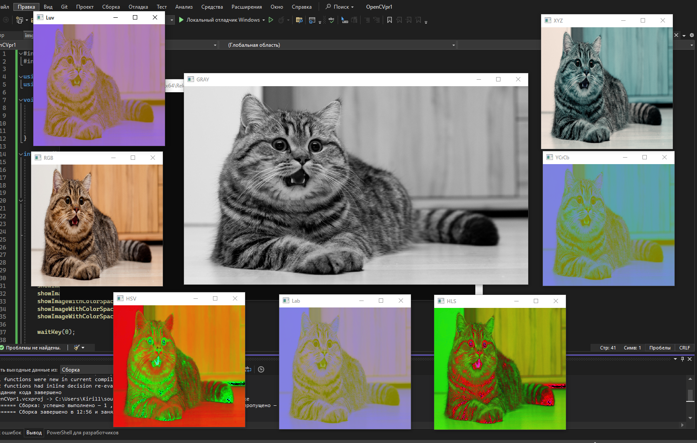

# Отчет

Цель состояла в том, чтобы загрузить изображение и выполнить несколько преобразований цветовых пространств с использованием функции `cvtColor` из библиотеки OpenCV.
Наш код загружает изображение, отображает его в исходном цветовом пространстве (BGR) и затем выполняет преобразования в различные цветовые пространства, такие как оттенки серого, HSV, Lab, YCrCb, XYZ, HLS и Luv.

## Результат

